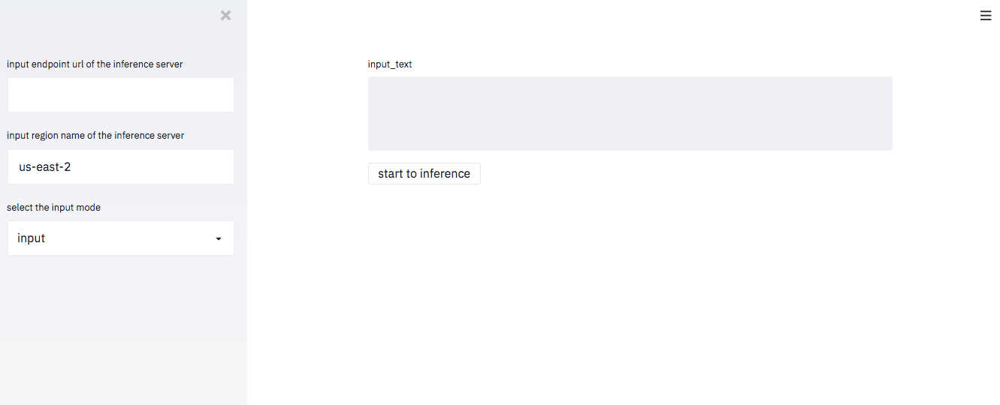

# YouyakuMan on SageMaker

 [](*https://poser.pugx.org/ali-irawan/xtra/v/unstable.svg*)  [](*https://poser.pugx.org/ali-irawan/xtra/license.svg*)

### Introduction

This is an one-touch extractive summarization machine on SageMaker.

using BertSum as summatization model, extract top N important sentences.

---

### Prerequisites

#### Setup Envrironment

you need to install or setup the following environment.

* [Docker](http://docs.docker.jp/index.html)
* [AWS Account](https://aws.amazon.com/jp/register-flow/)
* Python 3.6 or later

#### Install python packages

you need to install some python packages.
please execute the following command.

```
$ cd <root folder of this repository>
$ bash docker/setup/install.sh
```

#### Setup AWS Credentials

you need to set the AWS credential parameters to use SageMaker and AWS S3.
please set the following command.

ex) Linux or MacOS
```
$ export AWS_ACCESS_KEY_ID=<AWS ACCESS Key ID>
$ export AWS_SECRET_ACCESS_KEY=<AWS Secret ACCESS Key>
```

if other OS is used, please set the environment variable referring to [this page](https://docs.aws.amazon.com/ja_jp/cli/latest/userguide/cli-configure-envvars.html).

---


### Create docker images of training and inference

To create the youyakuman model on SageMaker, you need to create docker images for training and inference.
please execute the following command.

```
$ cd <root folder of this repository>
$ bash build_docker_images.sh <AWS ACCOUNT ID> <ECR Resion> <Device(cpu or gpu)>
```

### Train and Deploy the model on SageMaker

To create youyakuman model(= BERTSum), please execute the following commands.

```
$ cd src/setup
$ python3 setup.py --role <AWS role> --bucket_name <S3 bucket name> --region_name <AWS region> --endpoint_name <endpoint name>
```

AWS region information is descried in [this page](https://aws.amazon.com/jp/about-aws/global-infrastructure/regional-product-services/).


#### Introduction of setup parameters

TBD

---

### Using inference service on Sagemaker

#### start client service

If you want to use the youyakuman inference service, you need to start the client service.
please execute the following command to start it.

```
$ cd <root folder of this repository>
$ docker-compose up client
```

#### use client service

After client service is started, you access the following URL.
http://localhost:8501/

This client ui is the following image.


Please write the following parameter
* endpoint name
* region name
* input mode (currently only input)

After input the above parameters, please enter the text and push start button to start the inference service.

### Other informations

#### Training dataset of youyakuman model

[Livedoor news dataset](https://www.rondhuit.com/download.html) is used to train this youyakuman model.

#### Train Data Preparation

Training data should be a dictionary saved by `pickle`, to be specifically, a dictionary containing below contents of **one article**.

```
{'body': 'TEXT_BODY', 'summary': 'SUMMARY_1<sep>SUMMARY_2<sep>SUMMARY3'}
```

---
### Version Log:

2020-06-12  Training and Inference script are executed on SageMaker

2020-02-10  Training part added

2019-11-14  Add multiple language support

2019-10-29 	Add auto parse function, available for long article as input
